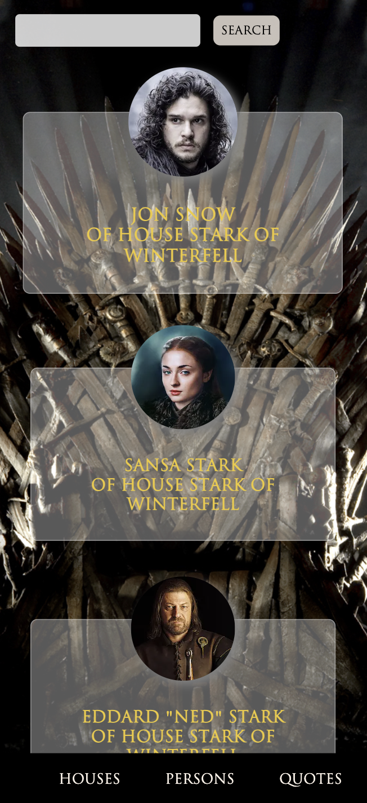
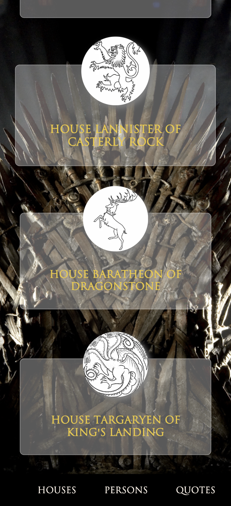
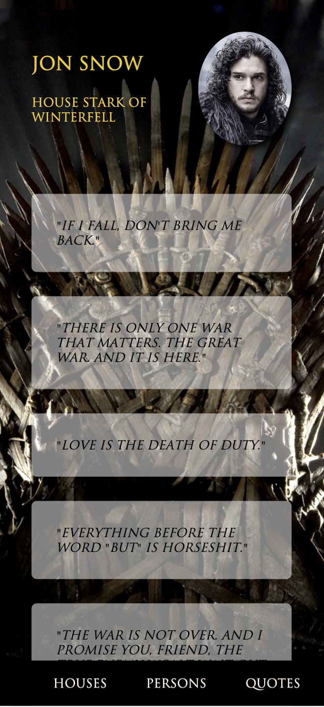

## About this project

This is a website of Game of Thrones houses, characters, and quotations. All data is fetched from [https://gameofthronesquotes.xyz](https://gameofthronesquotes.xyz/). 
This is a [Next.js](https://nextjs.org/) project bootstrapped with [`create-next-app`](https://github.com/vercel/next.js/tree/canary/packages/create-next-app). It is written in typescript and it's fully responsive.


## How to view this project

1. First, clone the repository by copying the SSH code from the github page and writing `git clone <the copied SSH key>` in your terminal.
2. Then navigate into the project directory. ```cd <project directory name>```
3. Run ```npm i``` in your terminal to install the packages.
4. Now run the development server: `npm run dev`

Open [http://localhost:3000](http://localhost:3000) with your browser to see the result.

## Screenshots

#### persons page


#### quotes page


#### persons slug page


#### persons page mobile view



#### houses page mobile view



#### persons slug page mobile view

